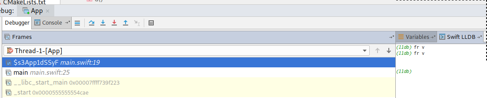
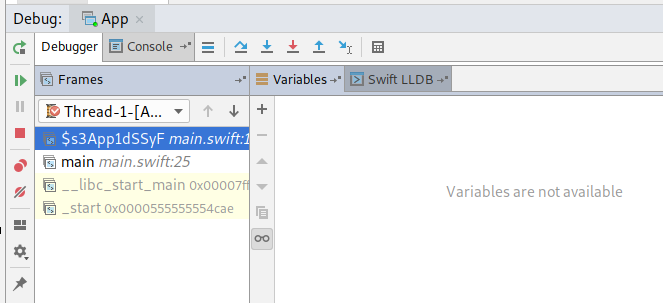

Example swift project for running in on Linux for CLion.

The project doesn't show variables if debugged on CLion but does via Swifts lldb:

Make sure you have `SWIFT_SDK` set to your swift build path or manually update the reference in CMakeLists.txt


# swift and lldb
```
$SWIFT_SDK/usr/bin/swift  build --verbose
lsb_release -r
/home/jlawson/build/swift-build/swift/swift-nightly-install/usr/bin/swiftc --driver-mode=swift -L /home/jlawson/build/swift-build/swift/swift-nightly-install/usr/lib/swift/pm/4_2 -lPackageDescription -swift-version 4.2 -I /home/jlawson/build/swift-build/swift/swift-nightly-install/usr/lib/swift/pm/4_2 -sdk / /home/jlawson/Downloads/App/Package.swift -fileno 7
/home/jlawson/build/swift-build/swift/swift-nightly-install/usr/bin/swiftc -module-name App -incremental -emit-dependencies -emit-module -emit-module-path /home/jlawson/Downloads/App/.build/x86_64-unknown-linux/debug/App.swiftmodule -output-file-map /home/jlawson/Downloads/App/.build/x86_64-unknown-linux/debug/App.build/output-file-map.json -c /home/jlawson/Downloads/App/Sources/main.swift -I /home/jlawson/Downloads/App/.build/x86_64-unknown-linux/debug -target x86_64-unknown-linux -swift-version 4.2 -enable-batch-mode -index-store-path /home/jlawson/Downloads/App/.build/x86_64-unknown-linux/debug/index/store -sdk / -Onone -g -enable-testing -j12 -DSWIFT_PACKAGE -DDEBUG -module-cache-path /home/jlawson/Downloads/App/.build/x86_64-unknown-linux/debug/ModuleCache -Xfrontend -color-diagnostics
/home/jlawson/build/swift-build/swift/swift-nightly-install/usr/bin/swiftc -sdk / -g -L /home/jlawson/Downloads/App/.build/x86_64-unknown-linux/debug -o /home/jlawson/Downloads/App/.build/x86_64-unknown-linux/debug/App -module-name App -emit-executable -Xlinker '-rpath=$ORIGIN' @/home/jlawson/Downloads/App/.build/x86_64-unknown-linux/debug/App.product/Objects.LinkFileList

$SWIFT_SDK/usr/bin/swift --version
Swift version 5.0-dev (LLVM dcb9eb74a7, Clang 95cdf7c9af, Swift bc9c876ee8)
Target: x86_64-unknown-linux-gnu
```

Try to debug the Linux build:

```
 $SWIFT_SDK/usr/bin/lldb .build/debug/App
 (lldb) target create ".build/debug/App"
 Current executable set to '.build/debug/App' (x86_64).
 (lldb) breakpoint set -f main.swift -l 19
 Breakpoint 1: where = App`App.d() -> Swift.String + 178 at main.swift:19:9, address = 0x0000000000001462
 (lldb) run
 Process 15780 launched: '/home/jlawson/Downloads/App/.build/debug/App' (x86_64)
 Process 15780 stopped
 * thread #1, name = 'App', stop reason = breakpoint 1.1
     frame #0: 0x0000555555555462 App`d() at main.swift:19:9
    16   public func d() -> String {
    17       let a = "Hello";
    18       var b = a + " ";
 -> 19       b = b + "World";
    20       let c = b + "!"
    21   
    22       return c
 Target 0: (App) stopped.
 (lldb) fr v
 (String) a = "Hello"
 (String) b = "Hello "
 (String) c = ""
```

# CLion and CMake

After building there are no frame variables



The Variables window cannot find any:




# Debugging on macOS

Building a debugging this on macOS seems fine. With the latest nightly swift snapshot.
