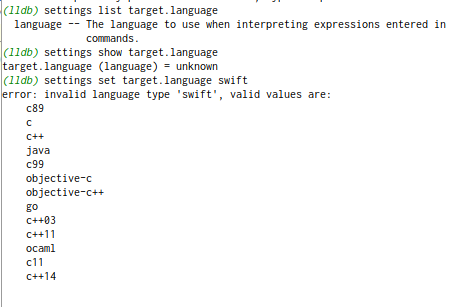

Example swift project for running in on Linux for CLion.

Set a break point 

Currently it seems that CLion cannot show variables during debug. Build and try.

Set SWIFT_SDK to the path of the swift toolchain.

# Debug
When debugging in Linux CLion appears to be unable to see frame variables or global variables. It appears to work fine 
on macOS.

Related issues: 

  1. [Debug swift unit test display: "No symbol info"](https://github.com/vadimcn/vscode-lldb/issues/27)
  1. [Make file level variables "frame" variables when you aren't in an explicit function](https://bugs.swift.org/browse/SR-4638)
  1. [Unable to Import Foundation](https://bugs.swift.org/browse/SR-3648)
  1. [Importing a modulemapped C library in REPL throws an error](https://bugs.swift.org/browse/SR-5524)

CLion Feature info:

  1. [Swift plugin for CLion](https://blog.jetbrains.com/clion/2015/12/swift-plugin-for-clion/)
  1. [CLion Swift Support](https://www.jetbrains.com/help/clion/swift.html)
  1. [Youtrack: Swift debugger does not show variable values when importing KituraNet in CLion
](https://youtrack.jetbrains.com/issue/CPP-9765)
  1. [Github: Swift debugger does not show variable values when importing KituraNet in CLion](https://github.com/IBM-Swift/Kitura-net/issues/191)
  
  
  LLDB info:
  
  1. [Debugging Swift code with LLDB](https://medium.com/flawless-app-stories/debugging-swift-code-with-lldb-b30c5cf2fd49)
  1. [Create Swift class instance variable with lldb, versus Objective-C](https://stackoverflow.com/questions/50879175/create-swift-class-instance-variable-with-lldb-versus-objective-c)
  
I don't know if it is an lldb context thing or what.

